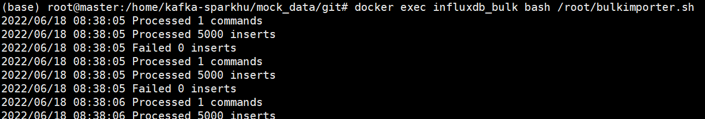

# timeseries parallel translator

해당 프로젝트는 오픈 시계열 데이터 소스인 [AMPds2](https://dataverse.harvard.edu/dataset.xhtml?persistentId=doi:10.7910/DVN/FIE0S4)의 시간 축을 평행이동시켜줍니다.<br>
변환된 데이터를 influxdb:1.8 docker container에 Bulk import 시켜줍니다.




## 1. AMPds2 dataset에 관하여
해당 프로젝트는 오픈 시계열 데이터 소스인 [AMPds2](https://dataverse.harvard.edu/dataset.xhtml?persistentId=doi:10.7910/DVN/FIE0S4)의 시간 축을 평행이동시켜줍니다.<br>
[AMPds2 dataset]은 Makonin Stephen이 disaggregation/NILM 연구를 위해 공개한 자신의 개인 전기, 수도, 천연가스 소비량 측정값 데이터가 담긴 버전 2 입니다.<br>
이 데이터 세트는 미터랑 2년 (2012년 4월 ~ 2014년 3월)의 모니터링에 대한 총 1,051,200개의 레코드가 포함되어 있습니다.<br><br>

데이터는 **1minute** 단위의 주기적인 **temporal resolution**을 지녔으며 결측값 없는 고퀄리티 정보를 제공합니다. 시계열 범위는 다음과 같습니다.
| 관측 시작(Unix Timestamp) | 관측 시작(UTC, RFC 3339) |  관측 종료(Unix Timestamp)   |  관측 종료(UTC, RFC 3339)   |
| :--------: | :--------: | :------: | :-----: |
|   `1333263600`    |   2012-04-01T07:00:00Z    | `1396335540` | 2014-04-01T06:59:00Z |

파일들은 각 계량기에 따라 다음의 이름을 가지며
- Electricity_{METERNAME}
- NaturalGas_{METERNAME}
- Water_{METERNAME}

이 프로젝트에서는 `Electricity_FGE` 파일만 다루고 있습니다.<br>

각 파일마다 10~100MB의 크기를 가지고 있습니다.<br>

그 밖에 다음과 같은 파일들을 포함하고 있습니다.
- Climate_* (해당 기간의 캐나다 기후 통계)
- Manual_* (계량기 별 데이터 디스크립션이 담긴 매뉴얼)


## 2. 주요 기능
- `timeseries_parallel_translator.py`는 레코드들의 time field를 추출하여 delta만큼 시간 축을 평행이동하고 다른이름(mock_data.txt)으로 저장합니다.
- `Dockerfile`로 생성된 docker image는 influxdb 1.8을 커스텀하여 mock_data.txt를 Bulk Import할 수 있습니다.

## 3. 시작하기 전 준비사항
이 프로젝트는 Python 3.7 버전 및 docker engine에서 개발되었습니다.<br><br>

timeseries_parallel_translator를 사용하기 위해선 다음이 필요합니다.
- Python >= 3.7
- Spark >= 3.0.3
- findspark, pyspark(with your Spark version)
- Hadoop (optional)

bulk import docker 빌드하고 컨테이너를 시작하기 위해선 다음이 필요합니다.
- Docker

## 4. 시작하기
다음과 같이 프로젝트를 받아주세요.
``` sh
$ mkdir {YOUR_DESIRED_PATH} && cd {YOUR_DESIRED_PATH}
$ git clone 
$ cd timeseries_parallel_translator
```
### 4.1 timeseries parallal translator.py
가상환경 설정이 권장됩니다.
``` sh
$ pip install findspark pyspark=={YOUR_SPARK_VERSION}
$ hdfs dfs -copyFromLocal Electricity_FGE.csv Electricity_FGE.csv # optional
$ spark-submit --master {YOUR_SPARK_MASTER} timeseries_parallel_translator.py
```
### 4.2 build importer (docker container)
``` sh
$ docker build -t influxdb_bulk_importer .
$ docker run -p {YOUR_EXPOSE_PORT}:8086 \
 -v {YOUR_VOLUME_TO_INFLUXDB}:/var/lib/influxdb \
--name {YOUR_CONTAINER_NAME} \
influxdb_bulk_importer
$ docker exec [-d] {YOUR_CONATINER_NAME} bash /root/bulkimporter.sh
```

## 5. 라이센스
This project is licensed under the terms of the **MIT license**.
